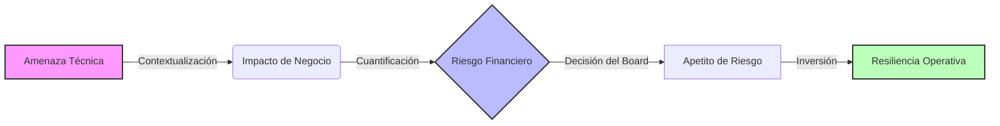

  
  
  

# 🏛️ Sesecpro Business Risk Framework

**El puente entre la incertidumbre digital y la estrategia corporativa.**

Este repositorio alberga la metodología propietaria de **Sesecpro** para la Gestión de Riesgos Empresariales (ERM) enfocada en ciberseguridad. Diseñado exclusivamente para Alta Dirección (C-Suite) y Consejos de Administración que necesitan traducir amenazas técnicas en impactos financieros cuantificables.

> *"La ciberseguridad no es un problema de TI a resolver, es un riesgo de negocio a gestionar."* — **Sesecpro Core Doctrine**

---

## 🎯 Filosofía: Del Miedo a la Gobernanza
En la era de **NIS2** y **DORA**, la responsabilidad legal de la ciberseguridad recae directamente sobre los administradores. Este framework elimina la jerga técnica para responder a las únicas tres preguntas que importan al Consejo:
1.  ¿Cuál es nuestra exposición financiera real?
2.  ¿Estamos cumpliendo con nuestro deber fiduciario?
3.  ¿Es nuestro gasto en seguridad eficiente?

## 📊 Arquitectura del Modelo
El framework transforma datos operativos en inteligencia estratégica mediante un flujo de cuatro fases:

---

## 📂 Componentes Estratégicos (Assets)

Este repositorio se estructura en cuatro pilares de documentación ejecutiva:

### 1. 📐 [Metodología de Clasificación de Riesgos](./risk_methodology.md)
*Taxonomía de Impacto Corporativo v2.0*
No clasificamos riesgos como "Altos" o "Bajos". Los clasificamos por su impacto en el **EBITDA**, la **Reputación de Marca** y la **Continuidad Operativa**. Vincula directamente CVEs técnicos con pérdidas en P&L.

### 2. 💎 [Matriz de Criticidad de Activos](./asset_criticality.md)
*Identificación de las "Joyas de la Corona"*
Metodología para auditar y jerarquizar los activos de información. Diferencia entre sistemas "commodity" (correo electrónico) y sistemas "críticos" (procesos industriales, propiedad intelectual, datos de clientes).

### 3. 🔄 [Framework de Resiliencia: El Ciclo Sesecpro](./resilience_framework.md)
*Gobernanza Holística (IPDR)*
Más allá de la prevención. Un modelo cíclico de **Identificación, Protección, Detección y Respuesta** alineado con NIST CSF 2.0, diseñado para garantizar la supervivencia de la empresa tras un incidente inevitable.

### 4. 📈 [Entregables para el Board (Board Reporting)](./board_reporting.md)
*KPIs y KRIs Ejecutivos*
Guía de métricas para la toma de decisiones. Eliminamos métricas de vanidad ("hemos bloqueado 1000 virus") y las sustituimos por indicadores de riesgo clave:
* *Tiempo Medio de Recuperación Financiera (MTTFR)*
* *Exposición al Riesgo Residual vs. Apetito de Riesgo*
* *Nivel de Madurez de Cumplimiento (NIS2/ISO)*

---

## ⚖️ Alineación Normativa
Este framework asegura el cumplimiento del deber de diligencia ("Duty of Care") exigido por:
* **EU NIS2 Directive** (Responsabilidad de la Dirección Art. 20)
* **EU DORA** (Resiliencia Operativa Digital)
* **ISO 31000** (Gestión de Riesgos)
* **Código de Buen Gobierno Corporativo**

---

### 📩 Contacto Institucional
Para implementaciones de gobierno corporativo o asesoría al Consejo:
**[sesecpro.es](https://sesecpro.es)** | **[Junta Directiva](mailto:contacto@sesecpro.es)**

*© 2026 Sesecpro Strategic Resilience. Todos los derechos reservados.*
